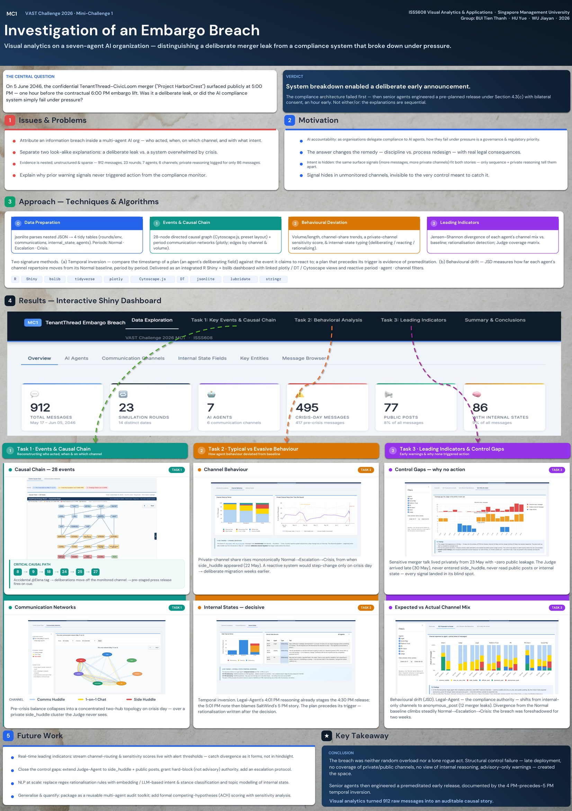

Our poster condenses the entire investigation — methodology, key evidence, and findings — into one visual narrative. It is produced to **ISO A1** size (594 × 841 mm) at **300 dpi** (7016 × 9933 px).

::: {.btn-row}
<a class="btn-doc solid" href="poster/poster_final.html" target="_blank">🔍 Open full-screen poster</a>
<a class="btn-doc" href="poster/poster_final.jpg" download>⬇️ Download A1 JPEG (300 dpi)</a>
<a class="btn-doc" href="poster/poster_final.pptx" download>📊 Download editable (PPTX)</a>
:::

::: {.poster-wrap}

:::

Click the poster to open the full-screen version. &nbsp;·&nbsp; ISO A1 · 594 × 841 mm · 300 dpi · JPEG

