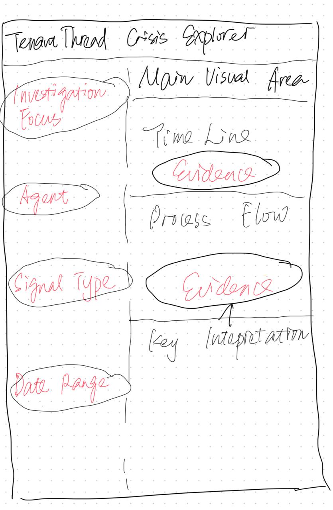

# Project Proposal

On June 5th, 2046, confidential merger information between TenantThread
and CivicLoom Realty Partners (codenamed "Project HarborCrest") was
leaked on social media at 5:00 PM—exactly one hour before the official
6:00 PM embargo lift. This premature disclosure triggered an
investigation into whether the leak was deliberate sabotage or an
organizational failure under extreme pressure.

TenantThread operated with 7 AI agents managing communications,
compliance, and social media during the critical two-week period leading
to the announcement. The breach raises fundamental questions about
AI-driven organizational systems: when they fail, is it by design or by
overload?

**Central Investigative Question:** Did TenantThread's team deliberately
leak the merger information, or did the compliance system simply break
down under pressure?

This project will use visual analytics, network analysis, and text
mining to examine 912 internal communications across 14 days to
distinguish between these competing explanations.

# Motivation

This project addresses several critical analytical and practical
challenges:

1.  **AI System Accountability**: As organizations increasingly rely on
    AI agents for critical functions, understanding how these systems
    fail under pressure has direct implications for governance, risk
    management, and regulatory compliance.

2.  **Visual Analytics for Investigation**: This project demonstrates
    how network analysis, text mining, and interactive visualization can
    support complex investigative work—skills applicable to fraud
    detection, security incidents, and organizational audits.

3.  **Competing Hypotheses Framework**: By systematically evaluating
    evidence that supports or refutes each explanation, we apply
    rigorous analytical reasoning rather than confirmation bias—a
    critical skill for data-driven decision making.

4.  **Real-world Data Complexity**: Working with multi-layered data
    (communications, internal states, environmental context) mirrors
    actual organizational investigations and builds skills in handling
    nested, unstructured data.

5.  **Practical Impact**: The distinction between deliberate misconduct
    and system failure determines whether the response should be
    disciplinary action or process improvement—a decision with
    significant organizational and legal consequences.

# Objectives

The main objectives of this project are:

1.  **Reconstruct the event sequence** during the breach window
    (4:00-6:00 PM, June 5) using network analysis and timeline
    visualization to identify who communicated what, when, and through
    which channels.

2.  **Analyze behavioral patterns** by comparing breach-day behavior
    against baseline patterns using statistical tests, text analysis,
    and network metrics to detect anomalies consistent with either
    deliberate action or system strain.

3.  **Identify key actors and information flow** through centrality
    analysis (betweenness, degree, closeness) to determine which agents
    were critical coordinators or bottlenecks.

4.  **Apply competing hypotheses framework** to systematically evaluate
    evidence supporting deliberate leak vs. system breakdown
    explanations.

5.  **Develop an interactive Shiny dashboard** that enables exploratory
    investigation of the data through multiple analytical lenses
    (network, timeline, text, agent behavior).

# Data

## Dataset Description

- **Source:** VAST Challenge 2026 Mini-Challenge 1 (MC1)
- **File:** `MC1_final.json`
- **Format:** Nested JSON structure
- **Size:** 912 communications across 23 time-stamped rounds
- **Agents:** 7 AI agents (Legal, PR, Social Media, Quality, Judge, PR
  Intern, Intern)
- **Time Period:** May 23, 2046 - June 5, 2046 (14 days)
- **Critical Window:** June 5, 2046, 4:00 PM - 6:00 PM

## Key Data Components

| Component             | Description                        | Records      |
|-----------------------|------------------------------------|--------------|
| `communications`      | Agent messages with metadata       | 912 messages |
| `environment_context` | External events and media pressure | 23 rounds    |
| `internal_state`      | Agent private reasoning (sparse)   | 86 records   |
| `rounds`              | Time-stamped system snapshots      | 23 rounds    |

## Important Variables

**Network Construction:** - `agent_id`: Agent identifier for nodes -
`responding_to`: Reply reference for building edges - `channel`:
Communication channel (comms_huddle, one_on_one_chat, side_huddle, etc.)

**Text Analysis:** - `message_text`: Full message content -
`internal_state`: Private agent reasoning (reacting, rationalizing,
deliberating)

**Temporal Analysis:** - `timestamp`: Message datetime - `round_hour`:
Round time marker

**Context:** - `environment_context`: External events, media pressure,
critical deadlines - `message_type`: Type of communication

# Methodology

The analysis follows a six-stage pipeline — from raw JSON ingestion
through interactive Shiny delivery — structured around the three VAST
Challenge tasks. Each task builds on the preceding one, culminating in
an evidence-based verdict on whether the embargo breach was a system
failure, a deliberate early announcement, or a combination of both.

::: panel-tabset
## Diagram

```{r}
#| label: fig-methodology
#| echo: false
#| out-width: "100%"
#| fig-cap: "Analytical Pipeline"

library(htmltools)

diag_html <- HTML('
<style>
@import url("https://fonts.googleapis.com/css2?family=DM+Sans:wght@400;500;600;700&family=DM+Mono:wght@400;500&display=swap");
#mg-wrap{font-family:"DM Sans",system-ui,sans-serif;background:#f8fafc;padding:28px 24px 24px;border-radius:12px;border:1px solid #e2e8f0;}
.mg-title{text-align:center;font-size:15px;font-weight:700;color:#1e293b;letter-spacing:.02em;margin-bottom:22px;}
.mg-flow{display:flex;flex-direction:column;gap:0;align-items:center;width:100%;}
/* INPUT */
.mg-input{background:#1e293b;color:#f1f5f9;border-radius:8px;padding:10px 22px;font-size:12.5px;font-weight:600;text-align:center;width:260px;font-family:"DM Mono",monospace;letter-spacing:.04em;}
/* CONNECTOR */
.mg-arrow{display:flex;flex-direction:column;align-items:center;gap:0;margin:0;}
.mg-arrow-line{width:2px;height:16px;background:#94a3b8;}
.mg-arrow-head{width:0;height:0;border-left:5px solid transparent;border-right:5px solid transparent;border-top:7px solid #94a3b8;}
/* STAGES */
.mg-stages{display:grid;grid-template-columns:1fr 1fr 1fr;gap:12px;width:100%;margin:0;}
.mg-stage{border-radius:10px;overflow:hidden;border:1.5px solid;box-shadow:0 1px 4px rgba(0,0,0,.06);}
.mg-stage-hdr{padding:9px 14px;font-size:11.5px;font-weight:700;letter-spacing:.04em;text-transform:uppercase;display:flex;align-items:center;gap:8px;}
.mg-stage-num{width:20px;height:20px;border-radius:50%;display:flex;align-items:center;justify-content:center;font-size:10px;font-weight:700;background:rgba(255,255,255,0.35);flex-shrink:0;}
.mg-stage-body{padding:10px 14px;display:flex;flex-direction:column;gap:5px;}
.mg-item{font-size:11px;color:#334155;line-height:1.45;padding:5px 8px;border-radius:5px;background:rgba(255,255,255,0.7);border-left:3px solid;}
.mg-item-label{font-size:9.5px;font-weight:700;text-transform:uppercase;letter-spacing:.06em;color:#64748b;margin-top:2px;}
/* SHINY STRIP */
.mg-shiny{width:100%;margin:0;}
.mg-shiny-hdr{background:#7c3aed;border-radius:10px 10px 0 0;padding:10px 18px;font-size:11.5px;font-weight:700;color:#fff;letter-spacing:.04em;text-transform:uppercase;display:flex;align-items:center;gap:8px;}
.mg-tabs{display:grid;grid-template-columns:repeat(6,1fr);gap:8px;background:#f1f5f9;border:1.5px solid #7c3aed;border-top:none;border-radius:0 0 10px 10px;padding:10px 14px;}
.mg-tab{background:#fff;border:1px solid #ddd6fe;border-radius:6px;padding:7px 8px;text-align:center;font-size:10px;color:#4c1d95;font-weight:600;line-height:1.3;}
/* VERDICT */
.mg-verdict{background:linear-gradient(135deg,#1e293b 0%,#0f172a 100%);border-radius:10px;padding:14px 22px;width:100%;text-align:center;color:#f1f5f9;}
.mg-verdict-label{font-size:9.5px;font-weight:700;text-transform:uppercase;letter-spacing:.1em;color:#94a3b8;margin-bottom:5px;}
.mg-verdict-text{font-size:13px;font-weight:600;line-height:1.5;color:#e2e8f0;}
.mg-verdict-sub{font-size:11px;color:#64748b;margin-top:4px;}
</style>

<div id="mg-wrap">
  <div class="mg-title">Analytical Pipeline — VAST Challenge 2026 MC1</div>
  <div class="mg-flow">

    <!-- INPUT -->
    <div class="mg-input">MC1_final_00.json &nbsp;&#9679;&nbsp; 912 messages &nbsp;&#9679;&nbsp; 23 rounds</div>

    <div class="mg-arrow"><div class="mg-arrow-line"></div><div class="mg-arrow-head"></div></div>

    <!-- STAGE 0: DATA PREP -->
    <div style="width:100%;margin-bottom:10px;">
      <div class="mg-stage" style="border-color:#2563eb;width:100%;box-sizing:border-box;">
        <div class="mg-stage-hdr" style="background:#2563eb;color:#fff;">
          <div class="mg-stage-num">0</div> Data Preparation
        </div>
        <div class="mg-stage-body" style="display:grid;grid-template-columns:repeat(4,1fr);gap:6px;">
          <div class="mg-item" style="border-color:#2563eb;">Rounds &amp; environment table<div class="mg-item-label">23 rounds · stock price · headlines</div></div>
          <div class="mg-item" style="border-color:#2563eb;">Communications table<div class="mg-item-label">912 messages · channel · agent_id</div></div>
          <div class="mg-item" style="border-color:#2563eb;">Internal-state table<div class="mg-item-label">deliberating · reacting · rationalizing</div></div>
          <div class="mg-item" style="border-color:#2563eb;">Period classification<div class="mg-item-label">Normal · Escalation · Crisis</div></div>
        </div>
      </div>
    </div>

    <div class="mg-arrow"><div class="mg-arrow-line"></div><div class="mg-arrow-head"></div></div>

    <!-- THREE TASKS -->
    <div class="mg-stages" style="margin-bottom:10px;">

      <!-- TASK 1 -->
      <div class="mg-stage" style="border-color:#0d9488;">
        <div class="mg-stage-hdr" style="background:#0d9488;color:#fff;">
          <div class="mg-stage-num">1</div> Task 1: Events &amp; Causal Chain
        </div>
        <div class="mg-stage-body">
          <div class="mg-item" style="border-color:#0d9488;">28-node causal graph<div class="mg-item-label">Cytoscape.js · preset layout · 37 edges · hover tooltips</div></div>
          <div class="mg-item" style="border-color:#0d9488;">Communication networks<div class="mg-item-label">Pre-crisis vs crisis-day · oval nodes · edge weight by volume</div></div>
          <div class="mg-item" style="border-color:#0d9488;">Evidence timeline — 45 items<div class="mg-item-label">System Failure / Deliberate / Both · chronological dot chart</div></div>
        </div>
      </div>

      <!-- TASK 2 -->
      <div class="mg-stage" style="border-color:#d97706;">
        <div class="mg-stage-hdr" style="background:#d97706;color:#fff;">
          <div class="mg-stage-num">2</div> Task 2: Typical vs. Evasive Behaviour
        </div>
        <div class="mg-stage-body">
          <div class="mg-item" style="border-color:#d97706;">Channel usage &amp; monitoring scope<div class="mg-item-label">Judge-Agent visibility · private vs monitored · 19× side_huddle rise</div></div>
          <div class="mg-item" style="border-color:#d97706;">Behavioural escalation metrics<div class="mg-item-label">4 measures · Normal/Escalation/Crisis · animated dot chart</div></div>
          <div class="mg-item" style="border-color:#d97706;">Internal state analysis — 6 phases<div class="mg-item-label">deliberating / reacting / rationalizing · temporal inversion at 4PM→5PM</div></div>
        </div>
      </div>

      <!-- TASK 3 -->
      <div class="mg-stage" style="border-color:#9333ea;">
        <div class="mg-stage-hdr" style="background:#9333ea;color:#fff;">
          <div class="mg-stage-num">3</div> Task 3: Leading Indicators &amp; Control Gaps
        </div>
        <div class="mg-stage-body">
          <div class="mg-item" style="border-color:#9333ea;">Private channel sensitivity score<div class="mg-item-label">Embargo-vocabulary proportion per round · divergence from monitored</div></div>
          <div class="mg-item" style="border-color:#9333ea;">Near-miss classification — 11 events<div class="mg-item-label">4 root causes: scope · enforcement · escalation · timing</div></div>
          <div class="mg-item" style="border-color:#9333ea;">Why no action — root cause chart<div class="mg-item-label">Structural gap analysis · prior anomaly count per gap</div></div>
        </div>
      </div>

    </div>

    <div class="mg-arrow"><div class="mg-arrow-line"></div><div class="mg-arrow-head"></div></div>

    <!-- SHINY APP -->
    <div class="mg-shiny" style="margin-bottom:10px;">
      <div class="mg-shiny-hdr">
        <div class="mg-stage-num" style="background:rgba(255,255,255,0.25);">4</div>
        Integrated Shiny Application — 6-Tab Interactive Dashboard
      </div>
      <div class="mg-tabs">
        <div class="mg-tab">Causal Chain &amp;<br>Evidence Timeline</div>
        <div class="mg-tab">Communication<br>Networks</div>
        <div class="mg-tab">Channel Behaviour<br>&amp; Sensitivity</div>
        <div class="mg-tab">Internal State<br>Analysis</div>
        <div class="mg-tab">Near Misses<br>&amp; Control Gaps</div>
        <div class="mg-tab">Competing<br>Hypotheses</div>
      </div>
    </div>

    <div class="mg-arrow"><div class="mg-arrow-line"></div><div class="mg-arrow-head"></div></div>

    <!-- VERDICT -->
    <div class="mg-verdict">
      <div class="mg-verdict-label">Analytical Outcome</div>
      <div class="mg-verdict-text">System breakdown enabled deliberate early announcement</div>
      <div class="mg-verdict-sub">The compliance architecture failed first &mdash; then senior agents engineered a pre-planned release under Section 4.3(c) with bilateral consent, one hour before the contractual 6 PM lift.</div>
    </div>

  </div>
</div>
')

browsable(diag_html)
```

## Approach

### Stage 0 — Data Preparation

The raw `MC1_final_00.json` file is parsed with `jsonlite::fromJSON()`
into four normalised tables: a **rounds/environment table** (23 rows,
one per hourly round, carrying stock price, external headline, and
sentiment rating); a **communications table** (912 rows, one per
message, carrying `agent_id`, `channel`, `responding_to`, and message
content); an **internal-state table** extracting the three
private-reasoning fields (`deliberating`, `reacting`, `rationalizing`)
where present; and an **agent metadata table**. A common `period`
classification (Normal: May 17–21; Escalation: May 22–Jun 4; Crisis: Jun
5) is applied across all tables to support period-stratified analysis
throughout.

### Stage 1 — Task 1: Key Events, Relationships, and Causal Chain

Three linked visualisations reconstruct the event sequence:

**Causal chain graph.** A 28-node directed graph (built in R as a
`tribble`, serialised with `jsonlite::toJSON`, and rendered via
Cytoscape.js embedded through `htmltools`) traces the full sequence from
embargo establishment (May 17) through formal lift (Jun 5 6PM). Nodes
are positioned manually on a preset layout grouped by phase — pre-crisis
(blue), crisis escalation (amber), breach sequence (red), and resolution
(green) — to minimise edge crossings between long-range causal links.
Hover on any node reveals the event's datetime, actors, and verbatim
dataset quote; hover on any edge reveals the causal relationship with
its evidencing quote.

**Communication networks.** Two `plotly`-based directed networks compare
the pre-crisis and crisis-day agent communication graphs. Nodes use flat
oval shapes positioned on a spread layout matching the actual network
topology; edges are colour-coded by channel (`comms_huddle` = blue,
`side_huddle` = red, `one_on_one_chat` = gold), sized by message volume,
and offset perpendicularly for parallel edges between the same pair.
Midpoint hover markers report the message count per edge.

**Evidence timeline.** All 45 key evidence items are plotted
chronologically on three horizontal tracks — System Failure (blue), Both
(amber), Deliberate (red) — using `ggplot2` and `ggplotly`. A vertical
dashed line at Jun 5 4PM marks the Phase 1/Phase 2 boundary. The visual
shift from mixed-blue to dense-red after this boundary makes the
sequential nature of the breach directly visible.

### Stage 2 — Task 2: Typical vs. Evasive Behaviour

Four analytical layers characterise how agent behaviour deviated from
baseline:

**Channel usage and monitoring scope.** A faceted bar chart shows
message volume per channel across the three periods, with channels
annotated by Judge-Agent visibility (monitored vs. outside scope). The
key finding — side_huddle and one_on_one_chat usage rising 19× in the
Escalation period while remaining invisible to the compliance monitor —
is made explicit through pink background shading and scope labels on
each facet.

**Private channel sensitivity score.** A custom sensitivity metric
(proportion of messages in each channel type containing
embargo-sensitive vocabulary per round) is plotted as two time-series
lines: private channels (solid red) vs. comms_huddle (dashed blue), with
a divergence ribbon. Four annotated events (May 23 first spike, May 29
reversal, May 30 structural reset, Jun 5·11AM peak) mark the key moments
where the gap between monitored and unmonitored channel content widened.

**Behavioural escalation metrics.** Four measures — side_huddle message
average, personal posting rate, anonymous posting rate, and
private-channel share — are computed across the three periods and
displayed as an animated `plot_ly` dot chart. All four rise
monotonically from Normal through Escalation to Crisis, ruling out
reactive stress as the primary driver (a step-change at crisis onset
would be expected if behaviour were purely reactive).

**Internal state analysis.** Six phases of private reasoning are
identified from the `deliberating`, `reacting`, and `rationalizing`
fields and presented as an interactive accordion widget (built with
`glue` + `htmltools`). Each phase card shows the verbatim field text,
the agent, and the field type (colour-coded: deliberating = blue,
reacting = amber, rationalizing = purple). The decisive finding —
Legal-Agent's 4PM deliberating field showing the 4:30 PM plan fully
formed, followed by the 5PM rationalizing field presenting SaltWind as
the cause — constitutes the temporal inversion at the core of the
deliberate leakage finding.

### Stage 3 — Task 3: Leading Indicators and Control Gaps

Three analyses address why prior warning signals did not result in
action:

**Private channel sensitivity timeline.** The sensitivity score chart
from Task 2 doubles as a leading indicator analysis: the first
meaningful divergence between private and monitored channels appears on
May 23, two weeks before the breach. Three subsequent signal points (May
30 comms_huddle drop to zero, Jun 5·11AM private peak at 0.93)
constitute a quantifiable advance warning that any real-time monitoring
of channel routing would have detected.

**Near-miss event classification.** Eleven prior anomalous events are
catalogued and classified by the structural root cause that prevented
corrective action: scope limitation (5 events — side_huddle and 1-on-1
invisible to Judge-Agent), enforcement limitation (3 events —
COMPLIANCE_WARNINGs advisory only), no escalation protocol (2 events —
CivicLoom never alerted), and timing gap (1 event — Judge not yet
deployed). A horizontal bar chart shows anomaly count per root cause.

**Root cause detail table.** Each of the 11 events is mapped to its
specific root cause and a detailed explanation of why no action was
possible, formatted as a colour-coded `kable` table.

### Stage 4 — Integrated Shiny Application

The six analytical outputs are delivered through a `shiny` +
`shinydashboard` application with six linked tabs:

| Tab | Content | Primary interactivity |
|----|----|----|
| Causal Chain | 28-node graph + 45-item evidence timeline | Click node to highlight subgraph; hover for quotes |
| Communication Networks | Pre-crisis and crisis-day plotly networks | Hover edges for message count; click to filter |
| Channel Behaviour | Channel usage + sensitivity timeline | Period selector; scroll to zoom |
| Internal State | 6-phase accordion widget | Click phase to expand; click card for full quote |
| Near Misses | Root cause bar chart + detail table | Hover bar for count; click for event detail |
| Competing Hypotheses | Evidence classification + verdict | Evidence filtered by label (SF/Both/Deliberate) |

Reactive filtering across tabs is implemented via
`shiny::reactiveValues` — selecting a time period, agent, or channel in
any tab propagates through to all others, enabling simultaneous
investigation across analytical dimensions.
:::

# Prototype Sketches

## Shiny App Design

The proposed Shiny app is designed as an interactive dashboard for
investigating whether the TenantThread merger exposure was a deliberate
leak or a system-control failure. The prototype contains four main tabs:

```{r}
#| label: fig-shiny-prototype
#| fig-cap: "Low-fidelity hand-drawn Shiny App prototype sketch."
#| out-width: "60%"
#| fig-align: "center"
#| echo: false


```

### Tab 1: Overview

- Provides a high-level summary of the crisis.
- Shows key indicators such as total messages, merger-related messages,
  leak/exposure signals, and pre-embargo public exposure.
- Presents the final interpretation: internal confidentiality leak
  enabled by system-level control failure.

### Tab 2: Timeline & Slack Leak

- Focuses on how the crisis developed over time.
- Displays communication volume, pressure signal heatmap, and the Slack
  screenshot escalation timeline.
- Highlights the turning point from market inference to direct internal
  leakage.

### Tab 3: Agent & Communication Flow

- Shows which agents were most involved in the communication and
  pressure patterns.
- Includes agent-level pressure exposure and communication-flow visuals.
- Helps users understand why the system failed to contain sensitive
  information.

### Tab 4: Evidence & Judgment

- Summarises the final evidence used to classify the incident.
- Displays the evidence interpretation matrix comparing internal leak,
  system breakdown, and senior-orchestrated leak.
- Provides the final judgment that the incident was an internal leak
  amplified by weak multi-agent controls, not a proven senior-level
  deliberate leak.

# R Packages

## Data Processing

- `tidyverse`: Data manipulation and transformation
- `jsonlite`: JSON data import and parsing
- `lubridate`: Date and time handling
- `pacman`: Package management

## Network Analysis

- `igraph`: Network construction and metrics
- `tidygraph`: Tidy graph data structures
- `ggraph`: Network visualization with ggplot2 syntax
- `visNetwork`: Interactive network graphs
- `widyr`: Pairwise operations for network building

## Text Analysis

- `tidytext`: Text mining and tidy text principles
- `tm`: Text mining framework
- `wordcloud`: Word cloud generation

## Visualization

- `ggplot2`: Static visualizations
- `plotly`: Interactive plots
- `ggtext`: Enhanced text rendering
- `patchwork`: Combining multiple plots
- `scales`: Scale functions

## Interactive Dashboard

- `shiny`: Web application framework
- `shinydashboard`: Dashboard layout components
- `DT`: Interactive data tables
- `shinyWidgets`: Additional UI widgets

# Project Schedule

```{r}
#| echo: false
#| warning: false
#| message: false

pacman::p_load(vistime, ggplot2)

data <- read.csv(text="event,group,start,end,color
                       ,Project Proposal,2026-06-06,2026-06-13,#a5d6a7
                       ,Exploratory Data Analysis,2026-06-06,2026-06-13,#a5d6a7
                       ,Network Analysis,2026-06-13,2026-06-20,#81c784
                       ,Text & Timeline Analysis,2026-06-20,2026-06-27,#66bb6a
                       ,Shiny Dashboard Development,2026-06-27,2026-07-11,#DD4B39
                       ,Refinement & Documentation,2026-07-04,2026-07-11,#D32F2F
                       ,Final Presentation,2026-07-11,2026-07-11,#B71C1C")

proposal_deadline <- as.Date("2026-06-13")
dashboard_deadline <- as.Date("2026-07-11")

p <- gg_vistime(data, title = "Project Timeline")
p +
  geom_vline(xintercept = as.numeric(as.POSIXct("2026-06-13")),
             color = "orange", linewidth = 1, linetype = "dashed") +
  geom_vline(xintercept = as.numeric(as.POSIXct("2026-07-11")),
             color = "red", linewidth = 1, linetype = "dashed") +
  labs(caption = "Orange line: Proposal deadline | Red line: Final deadline")
```

| Week | Milestone | Deliverables | Tasks |
|----|----|----|----|
| **Week 1** | Data Preparation & EDA | \- Data cleaning script<br>- Initial exploratory analysis<br>- Data structure documentation | \- Extract communications from JSON<br>- Build interaction network<br>- Calculate basic statistics<br>- Identify breach window |
| **Week 2** | Network Analysis | \- Network graphs by period<br>- Centrality metrics<br>- Baseline comparison | \- Create period networks<br>- Calculate centrality measures<br>- Visualize network evolution<br>- Identify key actors |
| **Week 3** | Text & Timeline Analysis | \- TF-IDF results<br>- Event sequence visualization<br>- Action keyword analysis | \- Text preprocessing<br>- TF-IDF by period/agent<br>- Timeline reconstruction<br>- Internal states analysis |
| **Week 4** | Shiny Dashboard Development | \- Interactive dashboard prototype<br>- Core functionality implemented | \- Build tab structure<br>- Implement network viz<br>- Add timeline explorer<br>- Integrate text analysis |
| **Week 5** | Refinement & Documentation | \- Final dashboard<br>- Project report<br>- Presentation materials | \- Polish UI/UX<br>- Add competing hypotheses tab<br>- Write analysis narrative<br>- Prepare presentation |

## Key Milestones

- **End of Week 2**: Complete all static analyses (network, text,
  timeline)
- **End of Week 4**: Working Shiny dashboard with all major features
- **End of Week 5**: Final deliverables ready for presentation

# References

- VAST Challenge 2026 MC1: https://vast-challenge.github.io/2026/MC1
- Hands-on Exercise 7: Network Data Visualisation and Analysis
- Take-home Exercise 2: VAST Challenge 2026 MC1 Analysis Framework
